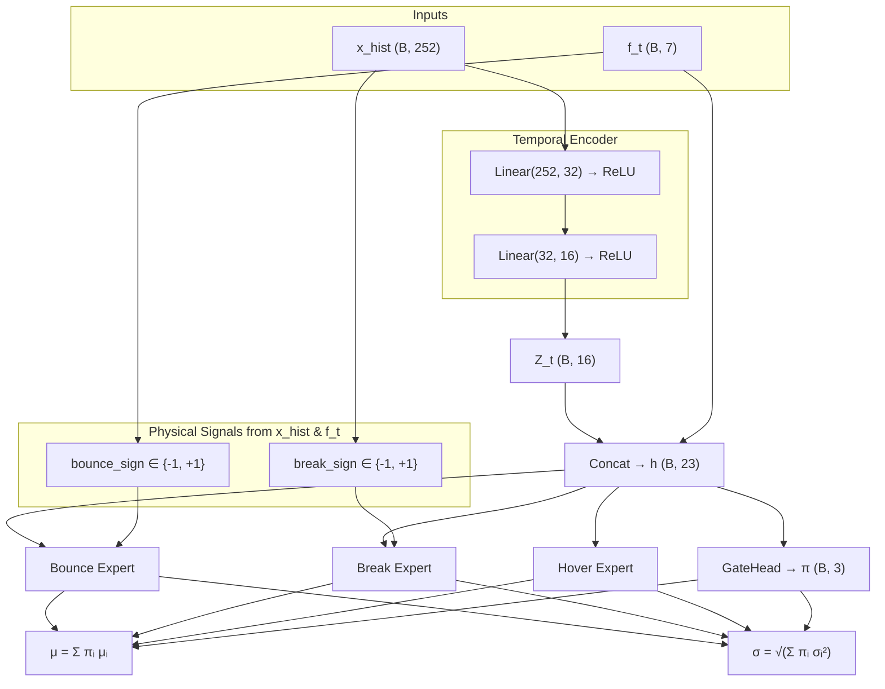

# Neural SDE — Mixture-of-Experts Architecture Analysis

## 1. The SDE Model

The network models a discrete-time Stochastic Differential Equation for asset prices:

$$X_{t+1} = X_t + \mu(X_t)\,\Delta t + \sigma(X_t)\,\sqrt{\Delta t}\;\varepsilon_t, \qquad \varepsilon_t \sim \mathcal{N}(0,1)$$

where $\mu(\cdot)$ and $\sigma(\cdot)$ are learned by the neural network and $\Delta t = 1$ (one trading day).

---

## 2. End-to-End Data Pipeline & Preprocessing

### 2.1 Raw Data → Sliding Windows

For each security, a sliding window of length $W = 252$ trading days produces:

| Symbol | Shape | Meaning |
|--------|-------|---------|
| `price_window` | $(B, 252)$ | $[X_{t-251},\dots,X_t]$ |
| `nxt_price` | $(B, 1)$ | $X_{t+1}$ (prediction target) |

### 2.2 Per-Sample Min-Max Normalization

Each sample is independently normalized to $[0, 1]$:

$$\tilde{X}_i = \frac{X_i - X_{\min}}{X_{\max} - X_{\min}}$$

applied to both `price_window` and `nxt_price` using the window's own min/max. This makes the network scale-invariant across different securities and price regimes.

> [!IMPORTANT]
> This is a **per-sample** normalization — each 252-day window uses its own min/max. The next-day target $X_{t+1}$ is normalized by the same statistics, so the network predicts in normalized coordinates.

### 2.3 Fibonacci Level Computation

Seven Fibonacci retracement levels are computed from the (already normalized) window:

$$L_k = X_{\min} + r_k \cdot (X_{\max} - X_{\min}), \quad r_k \in \{0,\;0.236,\;0.382,\;0.5,\;0.618,\;0.786,\;1.0\}$$

### 2.4 Feature Engineering — Signed Normalized Distances

The 7-dimensional feature vector $\mathbf{f}_t$ encodes the price's position relative to each Fibonacci level:

$$f_{t,k} = \frac{X_t - L_k}{\Delta}, \qquad \Delta = X_{\max} - X_{\min}$$

- **Positive** $f_{t,k}$: price is *above* level $L_k$
- **Negative** $f_{t,k}$: price is *below* level $L_k$
- **Near zero**: price is *at* level $L_k$

These features tell each expert *where the current price sits* in the Fibonacci structure — crucial for the bounce/break/hover semantics.

---

## 3. Full Architecture — `NeuralSDEMoE`

The model ([`NeuralSDEMoE`](file:///Users/daniel/Dev/GitHub/Repositories/fibonacci_neural_sde/amgm/models/mlp.py#L167-L267)) is a **Mixture-of-Experts** (MoE) with 3 structurally constrained experts.



### 3.1 Temporal Encoder

The encoder processes **only** the price history (no features yet):

$$\mathbf{Z}_t = \text{Encoder}(\mathbf{x}_{\text{hist}}) \in \mathbb{R}^{16}$$

Architecture: `Linear(252→32) → ReLU → Linear(32→16) → ReLU`

The latent vector is then concatenated with the Fibonacci features:

$$\mathbf{h} = [\mathbf{Z}_t \;\|\; \mathbf{f}_t] \in \mathbb{R}^{23}$$

### 3.2 Gate Head (SwiGLU Gating Network)

The [`GateHead`](file:///Users/daniel/Dev/GitHub/Repositories/fibonacci_neural_sde/amgm/models/mlp.py#L138-L165) uses a **SwiGLU** architecture with residual connections and LayerNorm:

$$\mathbf{g} = \text{SiLU}(\mathbf{h}\,W_g) \odot (\mathbf{h}\,W_v)$$
$$\mathbf{g}' = \text{LayerNorm}(\mathbf{g})$$
$$\mathbf{g}'' = \text{LayerNorm}(\mathbf{g}' + \text{SiLU}(\mathbf{g}'\,W_{\text{out}}))$$
$$\boldsymbol{\pi} = \text{softmax}\!\left(\frac{\mathbf{g}''\,W_{\text{proj}}}{\tau}\right) \in \mathbb{R}^3$$

where $\tau$ is the **gate temperature** (default 1.0).

### 3.3 Physical Signal Extraction

Before expert heads, two physical directional signals are computed:

| Signal | Formula | Meaning |
|--------|---------|---------|
| `bounce_sign` | $\text{sign}(f_{t, k^*})$ where $k^* = \arg\min_k |f_{t,k}|$ | Direction of bounce from nearest Fibonacci level |
| `break_sign` | $\text{sign}(X_t - X_{t-1})$ | Direction of recent momentum |

### 3.4 Expert Heads

Each expert is an [`ExpertHead`](file:///Users/daniel/Dev/GitHub/Repositories/fibonacci_neural_sde/amgm/models/mlp.py#L125-L136): `Linear(23→32) → LayerNorm → SiLU → Linear(32→1)`.

Each expert has a **drift head** and a **diffusion head**, with structurally different output activations:

#### Bounce Expert — "Elastic Restoring Force"
$$\mu_{\text{bounce}} = \underbrace{\text{bounce\_sign}}_{\pm 1} \cdot \text{softplus}(\text{head}(\mathbf{h}))$$
$$\sigma_{\text{bounce}} = \text{softplus}(\text{head}(\mathbf{h})) + 10^{-3}$$

The drift always pushes *toward* the nearest Fibonacci level (mean-reverting).

#### Break Expert — "Momentum Continuation"
$$\mu_{\text{break}} = \underbrace{\text{break\_sign}}_{\pm 1} \cdot \text{softplus}(\text{head}(\mathbf{h}))$$
$$\sigma_{\text{break}} = \text{softplus}(\text{head}(\mathbf{h})) + 10^{-3}$$

The drift always continues in the direction of recent momentum (trend-following).

#### Hover Expert — "Low-Volatility Consolidation"
$$\mu_{\text{hover}} = 0.05 \cdot \tanh(\text{head}(\mathbf{h}))$$
$$\sigma_{\text{hover}} = 0.001 + 0.02 \cdot \text{sigmoid}(\text{head}(\mathbf{h}))$$

Both drift and diffusion are strongly bounded — this expert models quiet, range-bound periods.

### 3.5 MoE Aggregation

**Drift** — weighted mean:
$$\mu = \sum_{i \in \{\text{bounce, break, hover}\}} \pi_i \cdot \mu_i$$

**Diffusion** — variance-weighted (not standard-deviation weighted):
$$\sigma = \sqrt{\sum_{i} \pi_i \cdot \sigma_i^2}$$

> [!NOTE]
> The variance-weighted aggregation $\sigma^2 = \sum \pi_i \sigma_i^2$ is the correct formula for the variance of a mixture. A naïve $\sigma = \sum \pi_i \sigma_i$ would underestimate variance.

---

## 4. Loss Function — Exact Mathematics

The total loss is computed in [`_compute_loss`](file:///Users/daniel/Dev/GitHub/Repositories/fibonacci_neural_sde/amgm/models/neural_SDE/runner.py#L123-L167):

$$\boxed{\mathcal{L} = \mathcal{L}_{\text{SDE}} - \beta \cdot H(\boldsymbol{\pi}) + \lambda \cdot \mathcal{L}_{\text{balance}}}$$

### 4.1 SDE Negative Log-Likelihood $\mathcal{L}_{\text{SDE}}$

Given the Euler-Maruyama discretization, $X_{t+1} | X_t \sim \mathcal{N}(X_t + \mu\,\Delta t,\; \sigma^2\,\Delta t)$, the per-sample NLL is:

$$\ell_i = \frac{1}{2}\left[\log(\sigma_i^2 \Delta t + \epsilon) + \frac{(\Delta X_i - \mu_i \Delta t)^2}{\sigma_i^2 \Delta t + \epsilon}\right]$$

where $\Delta X_i = X_{t+1}^{(i)} - X_t^{(i)}$, and $\epsilon = 10^{-6}$ for numerical stability.

The batch loss is:

$$\mathcal{L}_{\text{SDE}} = \frac{1}{B} \sum_{i=1}^{B} \ell_i$$

> [!NOTE]
> This is the Gaussian log-likelihood of the SDE transition density, with a constant $-\frac{1}{2}\log(2\pi)$ term dropped since it doesn't affect gradients.

### 4.2 Entropy Regularization $H(\boldsymbol{\pi})$

$$H(\boldsymbol{\pi}) = \frac{1}{B}\sum_{i=1}^{B}\left[-\sum_{k=1}^{3}\pi_{i,k}\log(\pi_{i,k} + 10^{-8})\right]$$

**Subtracted** from the loss (with coefficient $\beta$), so *maximizing* entropy is incentivized — this prevents the gate from collapsing to a single expert.

- Maximum entropy: $H = \log 3 \approx 1.099$ (uniform $\pi = [1/3, 1/3, 1/3]$)
- Minimum entropy: $H = 0$ (deterministic, one-hot $\pi$)

### 4.3 Balance Loss $\mathcal{L}_{\text{balance}}$

$$\bar{\pi}_k = \frac{1}{B}\sum_{i=1}^{B}\pi_{i,k}, \qquad \mathcal{L}_{\text{balance}} = \sum_{k=1}^{3}\left(\bar{\pi}_k - \frac{1}{3}\right)^2$$

This is a **coefficient of variation**–style loss that penalizes uneven *batch-level* utilization of experts. It equals zero when each expert receives equal average weight across the batch.

---

## 5. All Regularizations Applied

| Regularization | Where | Mathematical Form | Purpose |
|---|---|---|---|
| **Entropy maximization** | Loss | $-\beta \cdot H(\boldsymbol{\pi})$ | Prevent gate collapse to one expert |
| **Balance loss** | Loss | $\lambda \sum_k (\bar\pi_k - 1/3)^2$ | Ensure equal batch utilization |
| **Entropy β schedule** | Runner | Cosine decay: $\beta_{\max} \to \beta_{\min}$ | Start exploratory, refine later |
| **Weight decay** | Optimizer | $\lambda_{\text{wd}} = 10^{-5}$ (Adam) | L2 regularization on all params |
| **Structural constraints** | Experts | `softplus`, `tanh`, `sigmoid` output clamps | Physics-informed output bounds |
| **LayerNorm** | Experts + Gate | Normalizes activations | Training stability |
| **Softplus on σ** | Diffusion heads | $\sigma = \text{softplus}(\cdot) + \epsilon$ | Strictly positive diffusion |

---

## 6. Expert Collapse Problem

### What Is Expert Collapse?

Expert collapse occurs when the gating network $\boldsymbol{\pi}$ learns to assign nearly all weight to a **single expert** for every input. Mathematically:

$$\pi_k \to \begin{cases} 1 & \text{for some fixed } k^* \\ 0 & \text{for all } k \neq k^* \end{cases}$$

When this happens, the unused experts receive near-zero gradients (because their outputs are multiplied by $\pi_k \approx 0$), and their parameters stop learning — a self-reinforcing feedback loop. The model degenerates to a single-expert network, wasting capacity.

### Current Defenses Already in Place

The codebase already has:
1. **Entropy regularization** ($-\beta \cdot H(\pi)$) — encourages diverse gating
2. **Balance loss** ($\lambda \sum (\bar\pi_k - 1/3)^2$) — prevents batch-level imbalance
3. **Entropy β schedule** — cosine decay from $\beta_{\max}=0.1$ to $\beta_{\min}=0.01$

---

## 7. Proposed Solutions for Expert Collapse

### 7.1 Different Entropy Regularization Strengths

#### The Idea

Instead of a single scalar $\beta$ for all experts, use **per-expert** entropy targets or an **adaptive β** that responds to each expert's current utilization:

#### Implementation A — Per-Expert Adaptive β

```python
def _adaptive_entropy_loss(self, pi, base_beta):
    """Stronger entropy push for underutilized experts."""
    # pi: (batch, 3)
    f_m = pi.mean(dim=0)                     # (3,) — avg utilization per expert
    target = 1.0 / pi.shape[-1]              # 1/3

    # Experts below target get stronger beta (up to 3× base)
    utilization_ratio = (f_m / target).clamp(0.1, 1.0)  # (3,)
    per_expert_beta = base_beta / utilization_ratio      # weaker experts → higher β

    # Weighted entropy: emphasize contributions from underused experts
    log_pi = torch.log(pi + 1e-8)            # (batch, 3)
    weighted_entropy = -torch.sum(
        per_expert_beta.unsqueeze(0) * pi * log_pi, dim=-1
    )  # (batch,)
    return weighted_entropy.mean()
```

In the loss line, replace:
```python
# Before
entropy_term = beta * mean_entropy

# After
entropy_term = self._adaptive_entropy_loss(pi, beta)
```

#### How It Solves Collapse

When expert $k$ is underutilized ($\bar\pi_k \ll 1/3$), its effective $\beta_k$ increases, which amplifies the gradient that pushes the gate to assign more weight to that expert. Conversely, a dominant expert gets a weaker entropy push, allowing it to specialize without being forced uniform. The system self-corrects: as an expert recovers utilization, its $\beta_k$ decreases back to baseline.

#### Implementation B — Rényi / Tsallis Entropy

An alternative is to use **Tsallis entropy** of order $q < 1$ instead of Shannon entropy:

$$H_q(\boldsymbol{\pi}) = \frac{1}{q - 1}\left(1 - \sum_k \pi_k^q\right)$$

For $q < 1$, Tsallis entropy penalizes small probabilities *more aggressively* than Shannon entropy, making it harder for any expert to reach $\pi_k \approx 0$:

```python
def _tsallis_entropy(self, pi, q=0.5):
    """Tsallis entropy: more aggressive against near-zero expert weights."""
    return (1.0 / (q - 1.0)) * (1.0 - torch.sum(pi ** q, dim=-1))
```

---

### 7.2 Temperature Scaling

#### The Idea

The gate already has a temperature parameter $\tau$ in the softmax:

$$\pi_k = \frac{\exp(z_k / \tau)}{\sum_j \exp(z_j / \tau)}$$

- **High τ (e.g., 2–5):** flattens the distribution → more uniform → prevents collapse
- **Low τ (e.g., 0.1–0.5):** sharpens the distribution → more decisive routing → encourages specialization

#### Implementation — Learnable or Scheduled Temperature

**Option 1: Annealing Schedule** (simplest, most reliable):

```python
class TemperatureScheduler:
    """Start warm (flat routing), anneal to sharp (specialized routing)."""
    def __init__(self, tau_max=3.0, tau_min=0.5, warmup_steps=200, decay_steps=1000):
        self.tau_max = tau_max
        self.tau_min = tau_min
        self.warmup_steps = warmup_steps
        self.decay_steps = decay_steps
        self.current_step = 0

    def step(self):
        if self.current_step < self.warmup_steps:
            tau = self.tau_max
        elif self.current_step >= self.warmup_steps + self.decay_steps:
            tau = self.tau_min
        else:
            progress = (self.current_step - self.warmup_steps) / max(1, self.decay_steps)
            tau = self.tau_min + (self.tau_max - self.tau_min) * 0.5 * (1 + math.cos(math.pi * progress))
        self.current_step += 1
        return tau
```

In [`NeuralSDEMoE.forward`](file:///Users/daniel/Dev/GitHub/Repositories/fibonacci_neural_sde/amgm/models/mlp.py#L203), the temperature is already used:
```python
pi = F.softmax(self.gate_head(h) / self.gate_temperature, dim=-1)
```

So you'd update `self.gate_temperature` from the scheduler each training step:
```python
# In NeuralSDERunner.training_step:
if self.temperature_scheduler is not None:
    self.model.gate_temperature = self.temperature_scheduler.step()
```

**Option 2: Learnable Temperature:**

```python
# In NeuralSDEMoE.__init__:
self.log_temperature = nn.Parameter(torch.tensor(math.log(2.0)))

# In forward:
tau = self.log_temperature.exp().clamp(min=0.1, max=10.0)
pi = F.softmax(self.gate_head(h) / tau, dim=-1)
```

#### How It Solves Collapse

High temperature at the start ensures that **all experts receive meaningful gradients** from the beginning of training, because $\pi_k \gg 0$ for all $k$. By the time temperature anneals down, each expert has already learned useful representations, so the gate can sharpen toward specialization without any expert being starved.

| Phase | Temperature | Gate Behavior | Effect |
|-------|-------------|---------------|--------|
| Early training | $\tau \gg 1$ | Near-uniform $\pi \approx [0.33, 0.33, 0.33]$ | All experts trained equally |
| Mid training | $\tau \approx 1$ | Soft specialization | Experts begin to differentiate |
| Late training | $\tau \ll 1$ | Sharp routing | Decisive expert selection |

---

### 7.3 Combining Both Approaches

The two techniques are **complementary** and can be used together:

- **Temperature scaling** prevents collapse *at initialization* by ensuring uniform gradient flow
- **Adaptive entropy β** prevents collapse *during training* by dynamically boosting underutilized experts

```python
# Combined: temperature anneals from warm to cool,
# while adaptive beta catches any expert that starts falling behind
loss = sde_loss - adaptive_entropy_loss(pi, beta) + lambda * balance_loss
# where pi was computed with: softmax(logits / tau_scheduled)
```

> [!TIP]
> A practical starting recipe:
> - Temperature: anneal from $\tau = 3.0 \to 0.5$ over the first 1000 steps
> - Entropy β: anneal from $\beta = 0.1 \to 0.01$, with per-expert adaptation
> - Monitor `pi_mean_e0/e1/e2` in TensorBoard — all three should stay above 0.15 throughout training
